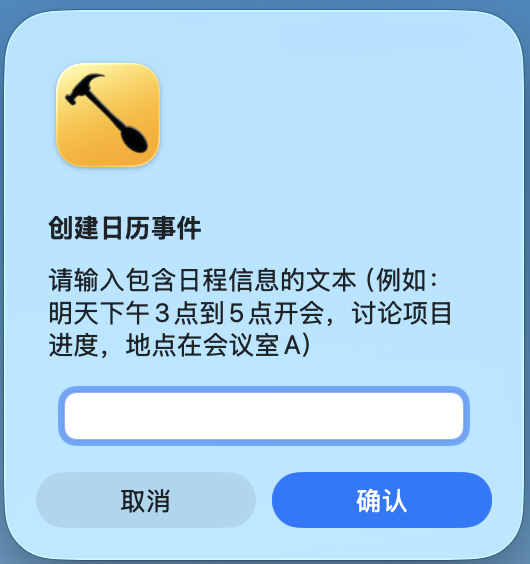
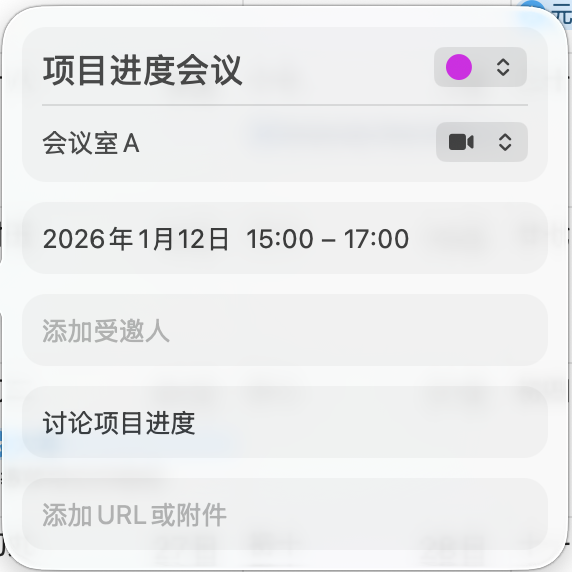

## 📖 使用方法 {#usage}

### 基本操作流程

#### 使用快捷键

所有功能都通过"Hyper 键 + 字母键"的组合来触发：

**Hyper 键** = `Command (⌘)` + `Shift (⇧)` + `Option (⌥)`

**使用方法**：
1. 同时按住 `Command`、`Shift` 和 `Option` 三个键
2. 保持按住这三个键的同时，按下对应的字母键或数字键
3. 释放所有按键，功能即被触发

**示例**：
- 要切换显示器，按住 `⌘` + `⇧` + `⌥`，然后按 `M` 键
- 要启动鼠标移动，按住 `⌘` + `⇧` + `⌥`，然后按 `5` 键

---

### 常见任务实现方式

#### 任务一：在多个显示器之间移动窗口

**步骤**：
1. 确保已连接多个显示器
2. 点击要移动的窗口，使其成为当前活动窗口
3. 按下 `Hyper + M`（即 `⌘` + `⇧` + `⌥` + `M`）
4. 窗口会自动移动到下一个显示器

**注意**：
- 支持全屏窗口的移动
- 窗口在移动过程中会自动调整位置，避免残影

---

#### 任务二：清除显示器残影

**步骤**：
1. 如果发现显示器上有残影或显示异常
2. 按下 `Hyper + G`（即 `⌘` + `⇧` + `⌥` + `G`）
3. 系统会自动清除所有显示器的残影
4. 屏幕上会显示提示："已清除所有显示器残影"

---

#### 任务三：将文件移动到指定目录

**步骤**：
1. 打开 Finder，找到要移动的文件
2. 选中文件（可按住 `Command` 键多选多个文件）
3. 确保文件已选中（文件会高亮显示）
4. 按下 `Hyper + 2`（即 `⌘` + `⇧` + `⌥` + `2`）
5. 文件会自动移动到 iCloud 的指定目录
6. 屏幕上会显示移动结果："成功移动 X 个文件"或"部分成功 (X/Y)"

**注意**：
- 确保有足够的指定目录存储空间
- 移动操作不可撤销，请谨慎操作
g
---

#### 任务四：防止电脑休眠

**步骤**：
1. 按下 `Hyper + 5`（即 `⌘` + `⇧` + `⌥` + `5`）
2. 鼠标会开始在屏幕中央区域随机移动
3. 屏幕上会显示提示："鼠标随机移动已启动"
4. 电脑将保持活跃状态，不会进入休眠

**停止鼠标移动**：
- 按下 `Hyper + 6`（即 `⌘` + `⇧` + `⌥` + `6`）
- 屏幕上会显示提示："鼠标随机移动已停止"

**使用场景**：
- 下载大文件时防止电脑休眠
- 演示或展示时保持屏幕常亮
- 需要长时间保持电脑活跃状态

---

#### 任务五：切换窗口全屏

**步骤**：
1. 点击要切换的窗口，使其成为当前活动窗口
2. 按下 `Hyper + P`（即 `⌘` + `⇧` + `⌥` + `P`）
3. 窗口会在全屏模式和窗口模式之间切换

**注意**：
- 再次按下相同的快捷键可以切换回原来的模式
- 适用于大多数应用程序窗口

---

#### 任务六：重新加载配置

**步骤**：
1. 修改配置文件后（例如更改快捷键）
2. 按下 `Hyper + R`（即 `⌘` + `⇧` + `⌥` + `R`）
3. 配置会立即重新加载，无需重启 Hammerspoon
4. 屏幕上会显示提示："Hammerspoon 配置已加载！"

---

#### 任务七：创建日历事件

**功能说明**：通过自然语言输入自动创建日历事件，支持识别时间、地点、标题和描述。

**步骤**：
1. 按下 `Hyper + C`（即 `⌘` + `⇧` + `⌥` + `C`）
2. 屏幕上会弹出一个输入对话框

3. 在对话框中输入包含日程信息的文本（例如："明天下午3点到5点开会，讨论项目进度，地点在会议室A"）
4. 点击"确认"按钮
5. 系统会自动处理并创建日历事件
6. 创建成功后会显示提示："日历事件创建成功"

**注意事项**：
- 系统将利用大模型处理自然文本，确保已在 `config.lua` 中配置了有效的 OpenAI API 密钥。大模型可采用任意兼容OpenAI API的模型，包括ChatGPT、豆包、DeepSeek等。
- 支持的时间格式："明天下午3点"、"本周六14:00"、"1月15日上午9点"等
- 系统会自动提取标题、时间、地点和描述信息
- 创建的事件会保存在默认日历中

**示例输入**：
- "下周一上午10点到11点团队会议"
- "明天下午2点去健身房，时长1小时"
- "1月20日下午3点到5点项目评审，地点：公司大会议室，讨论项目进展"

---
